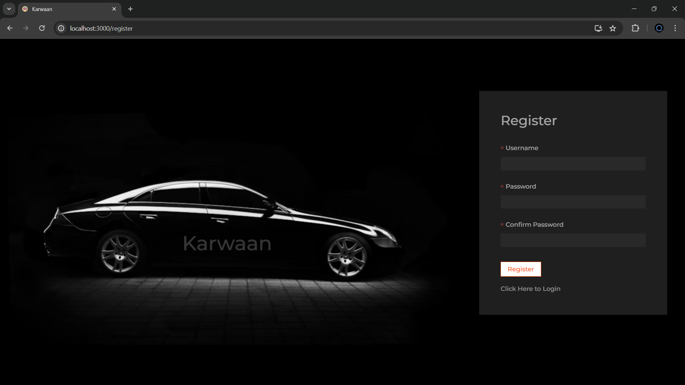

# Karwaan Car Rental

Karwaan Car Rental is a car rental management application designed to provide users with an easy and efficient way to rent vehicles for their travel needs. With Karwaan Car Rental, users can browse available cars, make reservations, manage bookings, and track rental history.

## Features

### Car Rental

- Browse available cars with details such as make, model, year, and rental price.
- Filter cars based on preferences such as vehicle type, location, and availability.
- View car details and images to make informed decisions.

### Reservation Management

- Make reservations for desired cars by specifying rental dates and other preferences.
- View and manage upcoming reservations, including the ability to modify or cancel bookings.

### Booking History

- Track rental history to view past bookings, including details such as rental dates, car information, and rental charges.
- Access invoices and receipts for completed bookings.

## Setup Instructions

To set up Karwaan Car Rental on your local machine, follow these steps:

1. Clone the repository to your local machine:

git clone https://github.com/prosedus007/karwaan_car_rental.git

css
Copy code

2. Navigate to the project directory:

cd spend-sensibly

markdown
Copy code

3. Install dependencies for both the frontend and backend:

cd client  
npm install  

npm install

markdown
Copy code

4. Set up the database:

   - Spend Sensibly uses MongoDB as its database. Make sure you have MongoDB installed and running on your machine.
   - Create a `.env` file in the `server` directory and add your MongoDB connection string:

MONGODB_URI=your-mongodb-connection-string

markdown
Copy code

5. Start the backend server:

npm start

markdown
Copy code

6. Start the frontend development server:

cd client  
npm start

less
Copy code

7. Open your web browser and navigate to `http://localhost:3000` to use Karwaan.

## Technologies Used

- MongoDB
- Express.js
- React.js
- Node.js

## Screenshots

        

